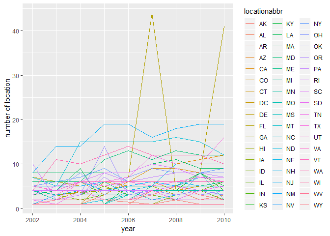

Homework 3
================
Yuxin
2018.10.12

Problem 1

``` r
data("brfs_smart2010")
```

    ## Warning in data("brfs_smart2010"): data set 'brfs_smart2010' not found

``` r
brfss_data = brfss_smart2010 %>%
janitor::clean_names() %>%
filter(topic == "Overall Health") %>%
filter(response == "Excellent"| response == "Very good" | response == "Good" | response == "Fair" | response == "Poor")
brfss_data$response = factor (brfss_data$response,levels = c("Excellent","Very good","Good","Fair","Poor"))
brfss_data
```

    ## # A tibble: 10,625 x 23
    ##     year locationabbr locationdesc class topic question response
    ##    <int> <chr>        <chr>        <chr> <chr> <chr>    <fct>   
    ##  1  2010 AL           AL - Jeffer~ Heal~ Over~ How is ~ Excelle~
    ##  2  2010 AL           AL - Jeffer~ Heal~ Over~ How is ~ Very go~
    ##  3  2010 AL           AL - Jeffer~ Heal~ Over~ How is ~ Good    
    ##  4  2010 AL           AL - Jeffer~ Heal~ Over~ How is ~ Fair    
    ##  5  2010 AL           AL - Jeffer~ Heal~ Over~ How is ~ Poor    
    ##  6  2010 AL           AL - Mobile~ Heal~ Over~ How is ~ Excelle~
    ##  7  2010 AL           AL - Mobile~ Heal~ Over~ How is ~ Very go~
    ##  8  2010 AL           AL - Mobile~ Heal~ Over~ How is ~ Good    
    ##  9  2010 AL           AL - Mobile~ Heal~ Over~ How is ~ Fair    
    ## 10  2010 AL           AL - Mobile~ Heal~ Over~ How is ~ Poor    
    ## # ... with 10,615 more rows, and 16 more variables: sample_size <int>,
    ## #   data_value <dbl>, confidence_limit_low <dbl>,
    ## #   confidence_limit_high <dbl>, display_order <int>,
    ## #   data_value_unit <chr>, data_value_type <chr>,
    ## #   data_value_footnote_symbol <chr>, data_value_footnote <chr>,
    ## #   data_source <chr>, class_id <chr>, topic_id <chr>, location_id <chr>,
    ## #   question_id <chr>, respid <chr>, geo_location <chr>

\*\*\* Q1: In 2002, which states were observed at 7 locations?

\*\*\* A1: Three states CT,FL,NC were observed at 7 locations in 2002.

``` r
brfss_data %>%
group_by(year,locationabbr) %>%
summarize(n_obs=n()/5) %>%
filter(year == "2002",n_obs==7)
```

    ## # A tibble: 3 x 3
    ## # Groups:   year [1]
    ##    year locationabbr n_obs
    ##   <int> <chr>        <dbl>
    ## 1  2002 CT               7
    ## 2  2002 FL               7
    ## 3  2002 NC               7

``` r
observation_state <- count(count(brfss_data,year,locationabbr,locationdesc),year,locationabbr)
ggplot(data=observation_state,aes(x=year,y=nn,color=locationabbr))+ylab("number of location")+geom_line(size=0.5)
```


