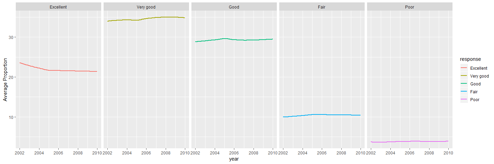

Homework 3
================
Yuxin
2018.10.12

Problem 1

``` r
data("brfs_smart2010")
```

    ## Warning in data("brfs_smart2010"): data set 'brfs_smart2010' not found

``` r
brfss_data = brfss_smart2010 %>%
janitor::clean_names() %>%
filter(topic == "Overall Health") %>%
filter(response == "Excellent"| response == "Very good" | response == "Good" | response == "Fair" | response == "Poor")
brfss_data$response = factor (brfss_data$response,levels = c("Excellent","Very good","Good","Fair","Poor"))
brfss_data
```

    ## # A tibble: 10,625 x 23
    ##     year locationabbr locationdesc class topic question response
    ##    <int> <chr>        <chr>        <chr> <chr> <chr>    <fct>   
    ##  1  2010 AL           AL - Jeffer~ Heal~ Over~ How is ~ Excelle~
    ##  2  2010 AL           AL - Jeffer~ Heal~ Over~ How is ~ Very go~
    ##  3  2010 AL           AL - Jeffer~ Heal~ Over~ How is ~ Good    
    ##  4  2010 AL           AL - Jeffer~ Heal~ Over~ How is ~ Fair    
    ##  5  2010 AL           AL - Jeffer~ Heal~ Over~ How is ~ Poor    
    ##  6  2010 AL           AL - Mobile~ Heal~ Over~ How is ~ Excelle~
    ##  7  2010 AL           AL - Mobile~ Heal~ Over~ How is ~ Very go~
    ##  8  2010 AL           AL - Mobile~ Heal~ Over~ How is ~ Good    
    ##  9  2010 AL           AL - Mobile~ Heal~ Over~ How is ~ Fair    
    ## 10  2010 AL           AL - Mobile~ Heal~ Over~ How is ~ Poor    
    ## # ... with 10,615 more rows, and 16 more variables: sample_size <int>,
    ## #   data_value <dbl>, confidence_limit_low <dbl>,
    ## #   confidence_limit_high <dbl>, display_order <int>,
    ## #   data_value_unit <chr>, data_value_type <chr>,
    ## #   data_value_footnote_symbol <chr>, data_value_footnote <chr>,
    ## #   data_source <chr>, class_id <chr>, topic_id <chr>, location_id <chr>,
    ## #   question_id <chr>, respid <chr>, geo_location <chr>

\*\*\* Q1: In 2002, which states were observed at 7 locations?

\*\*\* A1: Three states CT,FL,NC were observed at 7 locations in 2002.

``` r
brfss_data %>%
group_by(year,locationabbr) %>%
summarize(n_obs=n()/5) %>%
filter(year == "2002",n_obs==7)
```

    ## # A tibble: 3 x 3
    ## # Groups:   year [1]
    ##    year locationabbr n_obs
    ##   <int> <chr>        <dbl>
    ## 1  2002 CT               7
    ## 2  2002 FL               7
    ## 3  2002 NC               7

\*\*\* Q2: Make a “spaghetti plot” that shows the number of locations in each state from 2002 to 2010.

``` r
observation_state <- count(count(brfss_data,year,locationabbr,locationdesc),year,locationabbr)
ggplot(data=observation_state,aes(x=year,y=nn,color=locationabbr))+ylab("number of location")+geom_line(size=0.5)
```

 \*\*\* Q3 Make a table showing, for the years 2002, 2006, and 2010, the mean and standard deviation of the proportion of “Excellent” responses across locations in NY State.

``` r
brfss_excellent = subset(brfss_data,locationabbr == "NY" & response=="Excellent"&(year==2002 | year==2006 | year==2010)) %>%
group_by(year) %>%
summarize(mean_proportion = mean(data_value),
          sd_proportion = sd(data_value))
brfss_excellent
```

    ## # A tibble: 3 x 3
    ##    year mean_proportion sd_proportion
    ##   <int>           <dbl>         <dbl>
    ## 1  2002            24.0          4.49
    ## 2  2006            22.5          4.00
    ## 3  2010            22.7          3.57

\*\*\* Q4 For each year and state, compute the average proportion in each response category (taking the average across locations in a state). Make a five-panel plot that shows, for each response category separately, the distribution of these state-level averages over time.

``` r
brfss_proportion = brfss_data %>%
group_by(year,locationabbr,response) %>%
summarize(mean_data = mean(data_value))
ggplot(data=brfss_proportion, aes(x=year, y= mean_data, color=response))+
  geom_smooth(se=FALSE)+
  facet_grid(.~response)
```

    ## `geom_smooth()` using method = 'loess' and formula 'y ~ x'

    ## Warning: Removed 21 rows containing non-finite values (stat_smooth).



Problem 2

``` r
data("instacart")
instacart_data = instacart %>%
janitor::clean_names()
aisle_summary = count(instacart_data,aisle_id)
```

\*\*\* Q1: How many aisles are there, and which aisles are the most items ordered from?

\*\*\* A1: There are 134 aisles there. The aisles id of the most items ordered from is 83, and it is fresh vegetables.

\*\*\* Q2:Make a plot that shows the number of items ordered in each aisle. Order aisles sensibly, and organize your plot so others can read it.

``` r
aisle_information <- unique(instacart_data[,c("aisle_id","aisle")])
aisle_information <- aisle_information[order(aisle_information$aisle_id),]
aisle_order <- data.frame("aisle_id"= aisle_information$aisle_id, "aisle_name" = aisle_information$aisle, "Frequency"=aisle_summary$n)
aisle_order <- aisle_order[order(aisle_order$Frequency),]
aisle_order$aisle_name <- as.factor(aisle_order$aisle_name)
aisle_order$aisle_name = factor(aisle_order$aisle_name,aisle_order$aisle_name)
ggplot(aisle_order)+geom_bar(stat="identity",aes(x=aisle_name,y=Frequency))+coord_flip()
```


\*\*\* Q3:Make a table showing the most popular item in each of the aisles “baking ingredients”, “dog food care”, and “packaged vegetables fruits”.

``` r
aisle_popular <- subset(instacart_data,aisle =="baking ingredients"| aisle == "dog food care" | aisle == "packaged vegetables fruits")
aisle_popular %>%
group_by(aisle,product_name) %>%
count(product_name) %>%
group_by(aisle) %>%
filter(n==max(n))
```

    ## # A tibble: 3 x 3
    ## # Groups:   aisle [3]
    ##   aisle                    product_name                                  n
    ##   <chr>                    <chr>                                     <int>
    ## 1 baking ingredients       Light Brown Sugar                           499
    ## 2 dog food care            Snack Sticks Chicken & Rice Recipe Dog T~    30
    ## 3 packaged vegetables fru~ Organic Baby Spinach                       9784

\*\*\* A3: We can observe taht three most popular item in baking ingredients, dog food care, packaged vegetables fruits ailes are Ligtht Brown Sugar, Snack Sticks CHicken & Rice Recipe Dog Treats.

\*\*\* Q4:Make a table showing the mean hour of the day at which Pink Lady Apples and Coffee Ice Cream are ordered on each day of the week; format this table for human readers (i.e. produce a 2 x 7 table).

``` r
aisle_mean <- subset(instacart_data, product_name == "Pink Lady Apples" | product_name =="Coffee Ice Crean")
aisle_mean %>%
group_by(product_name, order_dow)%>%
summarize(mean_hour = mean(order_hour_of_day))%>%
spread(key=product_name,value=mean_hour)
```

    ## # A tibble: 7 x 2
    ##   order_dow `Pink Lady Apples`
    ##       <int>              <dbl>
    ## 1         0               13.4
    ## 2         1               11.4
    ## 3         2               11.7
    ## 4         3               14.2
    ## 5         4               11.6
    ## 6         5               12.8
    ## 7         6               11.9

Problem 3

``` r
data(ny_noaa)
noaa_data <- ny_noaa %>%
  separate(date,into=c("year","month","day",sep="-")) %>%
  gather(key=type,value=data,prcp:tmin,na.rm=TRUE) %>%
  transform(data = as.numeric(data))
```

    ## Warning: Expected 4 pieces. Missing pieces filled with `NA` in 2595176
    ## rows [1, 2, 3, 4, 5, 6, 7, 8, 9, 10, 11, 12, 13, 14, 15, 16, 17, 18, 19,
    ## 20, ...].

``` r
head(noaa_data)
```

    ##             id year month day   X. type data
    ## 17 US1NYAB0001 2007    11  17 <NA> prcp    3
    ## 18 US1NYAB0001 2007    11  18 <NA> prcp    0
    ## 19 US1NYAB0001 2007    11  19 <NA> prcp    0
    ## 20 US1NYAB0001 2007    11  20 <NA> prcp   25
    ## 21 US1NYAB0001 2007    11  21 <NA> prcp   71
    ## 22 US1NYAB0001 2007    11  22 <NA> prcp    8

``` r
noaa_snow <- subset(noaa_data, type == "snow")
noaa_snow_count <- count(noaa_snow, data)
filter(noaa_snow_count,n == max(n))
```

    ## # A tibble: 1 x 2
    ##    data       n
    ##   <dbl>   <int>
    ## 1     0 2008508

\*\*\* Q1: For snowfall, what are the most commonly observed values? Why?

\*\*\* A1: For snowfall, 0 are the most commonly observed values. This happens beacuse in the most time, we will not have snow days. Thus 0 are the most commonly observe values.

``` r
ny_noaa_plot1 <- subset(ny_noaa,!is.na(tmax) & !is.na(tmin))
ny_noaa_plot1$tmax <- as.numeric (ny_noaa_plot1$tmax)
ny_noaa_plot1$tmin <- as.numeric (ny_noaa_plot1$tmin)
ny_noaa_plot2 <- subset(noaa_data, type == "snow" & (data < 100 & data > 0 ))
par(mfrow=c(1,2))
plot1 <- ggplot(ny_noaa_plot1,aes(x=tmax,y=tmin))+stat_binhex()
plot2 <- ggplot(ny_noaa_plot2,aes(x=data,fill=year))+geom_histogram()
ggarrange(plot1,plot2,labels=c("Tmax vs Tmin","Distribution Of Snowfall"))
```

    ## `stat_bin()` using `bins = 30`. Pick better value with `binwidth`.


\*\*\* Q1: For snowfall, what are the most commonly observed values? Why?

\*\*\* A1:
